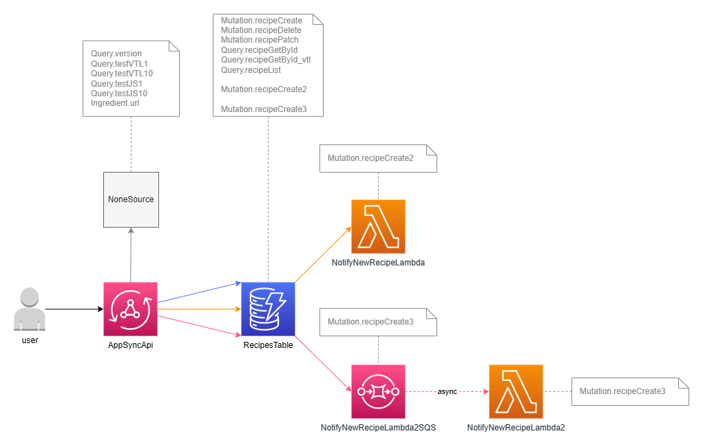

# API calls



## version

### Query
```
query  {
  version {
    date
    serverDateTime
    version
  }
}  
```  

### Response
```
{
  "data": {
    "version": {
      "date": "2023-04-29",
      "serverDateTime": "2023-04-30T18:05:02.260Z",
      "version": "1.0.0"
    },
  }
}
```

Query returns version informations. Query uses `NoneSource`, there is no resource queried, data are static or generated using `util`.

## testVTL1, testVTL10, testJS1, testJS10

### Query
```
query  {

  testVTL1 {
    count
    endTime
    endTimestamp
    startTime
    startTimestamp
    time
  }

  testVTL10 {
    count
    endTime
    endTimestamp
    startTime
    startTimestamp
    time
  }  

  testJS1 {
    count
    endTime
    endTimestamp
    startTime
    startTimestamp
    time
  }

  testJS10 {
    count
    endTime
    endTimestamp
    startTime
    startTimestamp
    time
  }  
}

```  

### Response
```
{
  "data": {
    "testVTL1": {
      "count": 2,
      "endTime": "2023-04-30T18:05:02.260Z",
      "endTimestamp": 1682877902260,
      "startTime": "2023-04-30T18:05:02.258Z",
      "startTimestamp": 1682877902258,
      "time": 2
    },
    "testVTL10": {
      "count": 20,
      "endTime": "2023-04-30T18:05:02.264Z",
      "endTimestamp": 1682877902264,
      "startTime": "2023-04-30T18:05:02.259Z",
      "startTimestamp": 1682877902259,
      "time": 5
    },
    "testJS1": {
      "count": 2,
      "endTime": "2023-04-30T18:05:02.260Z",
      "endTimestamp": 1682877902260,
      "startTime": "2023-04-30T18:05:02.259Z",
      "startTimestamp": 1682877902259,
      "time": 1
    },
    "testJS10": {
      "count": 20,
      "endTime": "2023-04-30T18:05:02.269Z",
      "endTimestamp": 1682877902269,
      "startTime": "2023-04-30T18:05:02.260Z",
      "startTimestamp": 1682877902260,
      "time": 9
    }
  }
}
```

Queries measurest time cost of resolvers/pipelines

* testVTL1: VTL resolver with templates
* testVTL10: VTL resolver with pipeline with 10 functions
* testJS1: JS resolver with pipeline with 1 function
* testJS10: JS resolver with pipeline with 10 functions

Query returns version informations. Query uses `NoneSource`, there is no resource queried, data are static or generated using `util`.

#### Response data

* **count**: how many request/response templates/handlers call triggered
* **endTime**: ISO representation of call end time
* **endTimestamp**: Timestamp in milliseconds of call end time 
* **start**: ISO representation of call start time
* **startTimestamp**: Timestamp in milliseconds of call start time 
* **time**: Number of milliseconds all processing took


## recipeGetById, recipeGetById_vtl

### Query
```
query {
  recipeGetById_vtl(id: "ABC") {
    cookingTime
    created
    id
    ingredients {
      amount
      name
      unit
      url
    }
    name
    preparationTime
    updated
  }

  recipeGetById(id: "c21aadd5-910b-49c8-8d75-1f3303c33a03") {
    cookingTime
    created
    id
    ingredients {
      amount
      name
      unit
      url
    }
    name
    preparationTime
    updated
  }
}
```

### Response

```
{
  "data": {
    "r1": null,
    "r2": {
      "cookingTime": 150,
      "created": "2023-04-30T11:54:28.315Z",
      "id": "c21aadd5-910b-49c8-8d75-1f3303c33a03",
      "ingredients": [
        {
          "amount": 1500,
          "name": "Chicken meat & bones",
          "unit": "g",
          "url": "https://www.google.com/search?q=Chicken+meat+%26+bones"
        },
        {
          "amount": 200,
          "name": "Ginger",
          "unit": "g",
          "url": "https://www.google.com/search?q=Ginger"
        },
        {
          "amount": 2,
          "name": "Water",
          "unit": "l",
          "url": "https://www.google.com/search?q=Water"
        }
      ],
      "name": "Ramen",
      "preparationTime": 30,
      "updated": "2023-04-30T11:54:28.315Z"
    }
  }
}
```

API call retrieve recipe data. Query uses `RecipesTableSource` to query DynamoDB directly. 

`recipeGetById` uses JS resolver, `recipeGetById_vtl` uses VTL resolver.

## recipeList

### Query
```
query {
  recipeList(input: { limit: 2, nextToken: null }) {
    items {
      cookingTime
      created
      id
      ingredients {
        amount
        name
        unit
        url
      }
      name
      preparationTime
      updated
    }
    nextToken
  }
}
```

### Response

```
{
  "data": {
    "recipeList": {
      "items": [
        {
          "cookingTime": 150,
          "created": "2023-04-30T11:54:28.315Z",
          "id": "c21aadd5-910b-49c8-8d75-1f3303c33a03",
          "ingredients": [
            {
              "amount": 1500,
              "name": "Chicken meat & bones",
              "unit": "g",
              "url": "https://www.google.com/search?q=Chicken+meat+%26+bones"
            },
            {
              "amount": 200,
              "name": "Ginger",
              "unit": "g",
              "url": "https://www.google.com/search?q=Ginger"
            },
            {
              "amount": 2,
              "name": "Water",
              "unit": "l",
              "url": "https://www.google.com/search?q=Water"
            }
          ],
          "name": "Ramen",
          "preparationTime": 30,
          "updated": "2023-04-30T11:54:28.315Z"
				},
				{
          "cookingTime": 10,
          "created": "2023-04-30T08:24:01.294Z",
          "id": "edcbc265-237c-4363-bdd9-aa2792b96852",
          "ingredients": [
            {
              "amount": 300,
              "name": "Salmon",
              "unit": "g",
              "url": "https://www.google.com/search?q=Salmon"
            }
          ],
          "name": "Salmon",
          "preparationTime": 2,
          "updated": "2023-04-30T08:24:01.294Z"
        }
      ],
      "nextToken": "AAAAAAAAAAAAAAAAAAAAAAAAAA................" 
    }
  }
}
```

Api call list recipes. Query uses `RecipesTableSource` to query DynamoDB directly. 

Function showcases use of paging (limit and nextToken)


## recipeCreate

### Query
```
mutation {
	recipeCreate(input: {
		cookingTime: 5,
		ingredients: [
			{
				amount: 250,
				name: "water"
				unit: "ml"
			},
			{
				amount: 1,
				name: "tea bag"
				unit: "pcs"
			}
		],
		name: "Tea",
		preparationTime: 1
	})
}
```

### Response

```
{
	"data": {
		"recipeCreate": "74bf2e91-81e6-4a14-a08e-8ee5943d52ff"
	}
}
```
Call creates recipe. Query uses `RecipesTableSource` to query DynamoDB directly. Should take like 250ms.

## recipeCreate2

### Query
```
mutation {
	recipeCreate2(input: {
		cookingTime: 5,
		ingredients: [
			{
				amount: 250,
				name: "water"
				unit: "ml"
			},
			{
				amount: 1,
				name: "tea bag"
				unit: "pcs"
			}
		],
		name: "Tea",
		preparationTime: 1
	})
}
```

### Response

```
{
	"data": {
		"recipeCreate": "74bf2e91-81e6-4a14-a08e-8ee5943d52ff"
	}
}
```
Call creates recipe. Query uses `RecipesTableSource` to query DynamoDB directly and then there is Lambda in pipeline (`NotifyNewRecipeLambdaSource`). 
Lambda is written to take 1 second so the whole processing takes like 1250ms.


## recipeCreate3

### Query
```
mutation {
	recipeCreate3(input: {
		cookingTime: 5,
		ingredients: [
			{
				amount: 250,
				name: "water"
				unit: "ml"
			},
			{
				amount: 1,
				name: "tea bag"
				unit: "pcs"
			}
		],
		name: "Tea",
		preparationTime: 1
	})
}
```

### Response

```
{
	"data": {
		"recipeCreate": "74bf2e91-81e6-4a14-a08e-8ee5943d52ff"
	}
}
```
Call creates recipe. Query uses `RecipesTableSource` to query DynamoDB directly and then there is SQS in pipeline (`NotifyNewRecipeLambda2SQSSource`). 
SQS contacts Lambda to continue processing. Lambda is written to take 1 second, but since there is SQS in the middle, whole Lambda process
becomes asynchronous and the whole call takes like 250ms. Lambda process takes happens in the background, not delaying API call.
This pattern should be used if possible (if you do not need the response from Lambda) to respond as fast as possible.


## recipePatch

### Query
```
mutation {
  recipePatch(id: "A", input: {
    cookingTime: 1,
    ingredients: [
      {
        amount: 250,
        name: "water"
        unit: "ml"
      }
    ],
    name: "New name",
    preparationTime: 5
  })
}
```

### Response

```
{
  "data": {
    "recipePatch": true
  }
}
```
Call pathes recipe. Query uses `RecipesTableSource` to query DynamoDB directly.
Call changes only passed (not null) properties. Properties, that are `null` are not updated.
Call showcases pipeline and using `ctx.prev.result`. 
